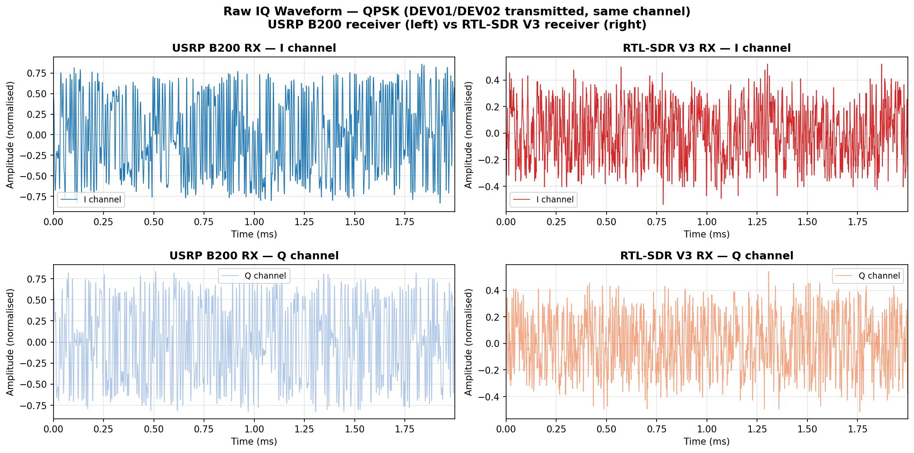
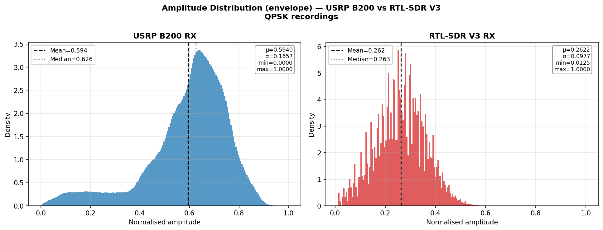
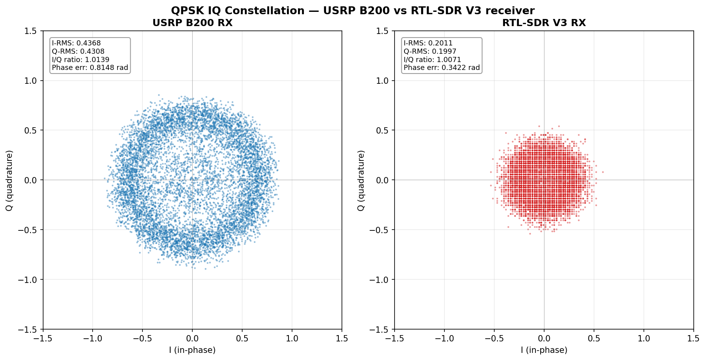
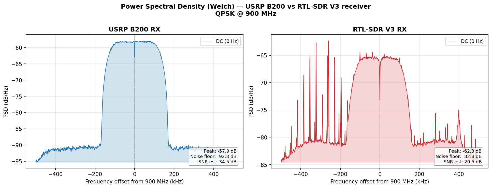
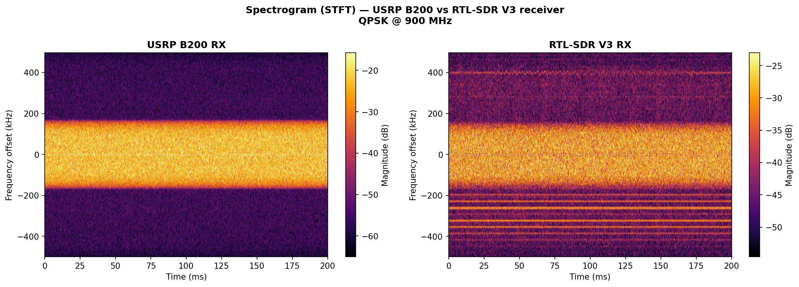
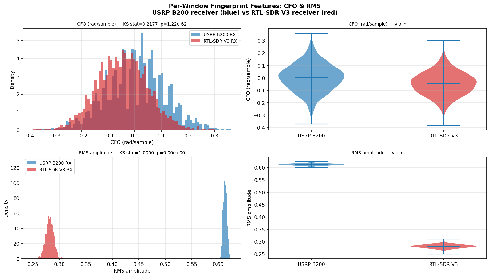
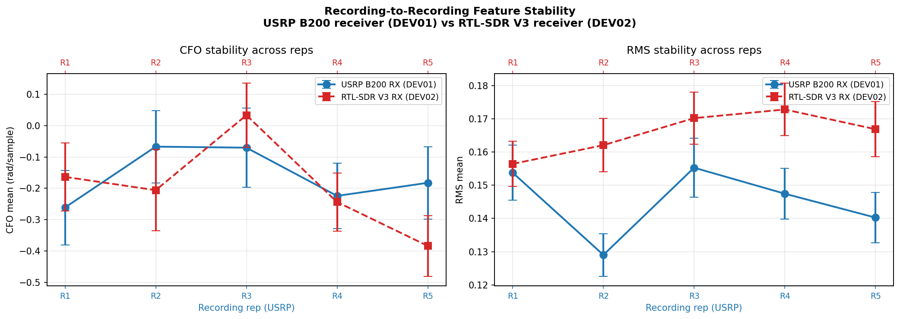
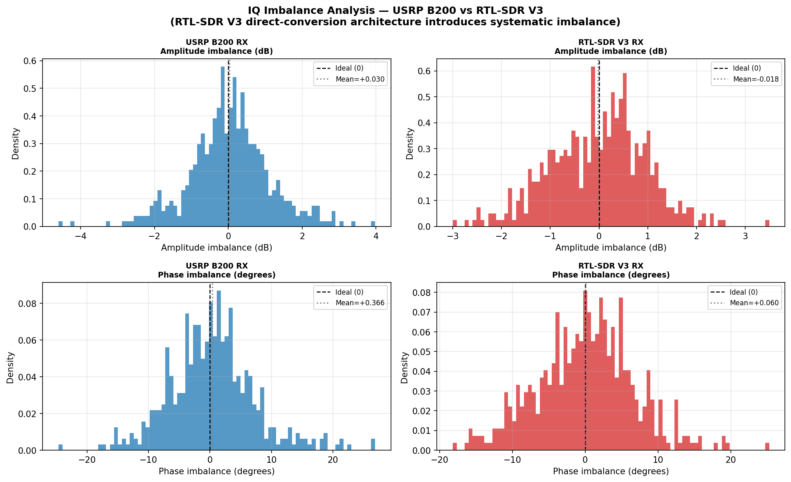
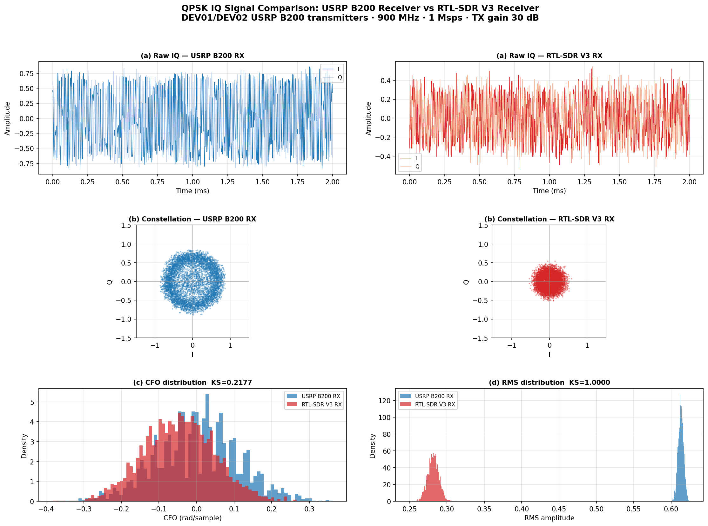

# Receiver Hardware Comparison: USRP B200 vs RTL-SDR V3

> **Experiment type:** Signal quality & feature-space analysis  
> **Modulation:** QPSK  
> **Notebook:** [`hw_comparison_experiment.ipynb`](hw_comparison_experiment.ipynb)  [](https://colab.research.google.com/github/Amitha4469/PLA-Thesis_Analysis/blob/main/experiment_HW_comparison/hw_comparison_experiment.ipynb)

---

## Overview

This experiment performs a direct side-by-side signal analysis of QPSK IQ recordings captured from the **same two USRP B200 transmitters** (DEV01 and DEV02) by **two different receiver hardware architectures**:

| Property | USRP B200 Receiver | RTL-SDR V3 Receiver |
|----------|-------------------|---------------------|
| Serial | 3288FAD | (dongle) |
| ADC resolution | **12-bit** | **8-bit** |
| Architecture | **Superheterodyne** | **Direct-conversion (zero-IF)** |
| RX gain | 30 dB (UHD) | RF 30 / IF 20 / BB 20 dB |
| AGC | Disabled (`rx_agc=Disabled`) | Off (`gain_mode=False`) |
| DC offset correction | Disabled (`dc_offs_enb=disabled`) | Off (`dc_offset_mode=0`) |
| IQ balance correction | Disabled (`iq_imbal_enb=disabled`) | Off (`iq_balance_mode=0`) |
| IQ format | fc32 (complex64) | fc32 (complex64) |

**Both receivers share:**  Centre frequency 900 MHz · Sample rate 1 Msps · TX gain 30 dB

**GRC source files:** [`DEV01_QPSK_S3.grc`](grc/DEV01_QPSK_S3.grc) (USRP RX) · [`DEV01_QPSK_S3_RTL.grc`](grc/DEV01_QPSK_S3_RTL.grc) (RTL-SDR RX)

---

## Research Context

This experiment provides the **mechanistic explanation** for the domain gap observed in [SQ4 (Cross-Hardware Domain Gap)](../experiment_SQ4_analysis/README.md). The B1 combined model trained on USRP recordings degraded by a mean of **+42.94 percentage points** when evaluated zero-shot on RTL-SDR recordings.

The question this experiment answers: **why?** By comparing the raw IQ signals, feature distributions, and IQ imbalance characteristics side-by-side, we can trace exactly which receiver-hardware properties cause the feature space shift that breaks the trained model.

---

## Dataset

| Source | Folder | Files | Reps | File size |
|--------|--------|-------|------|-----------|
| USRP B200 RX | `Recordings/Recordings_GNU_Improved/` | `DEV01_QPSK_S3_R1–R5.dat` | R1–R5 | ~171–180 MB each |
| RTL-SDR V3 RX | `Recordings_RTL/RTL_GNU_Improved/` | `DEV02_QPSK_S3_R2–R5_RTL.dat` | R2–R5 (R1 absent) | ~162–169 MB each |

Both datasets captured May 2026 in the same physical environment.

---

## Notebook Structure

| Cell | Analysis | Output |
|------|----------|--------|
| 1 | Drive mount | — |
| 2 | Imports, constants, **auto-discovery path resolver** | File manifest |
| 3 | Load raw IQ (drop 100k transient, normalise) | — |
| 4 | Raw IQ waveform — I & Q traces, 2 ms | `C1_raw_iq_waveform` |
| 5 | Amplitude (envelope) distribution + stats | `C2_amplitude_distribution` |
| 6 | IQ constellation diagram + I/Q imbalance metrics | `C3_constellation` |
| 7 | Power spectral density (Welch) | `C4_psd` |
| 8 | Spectrogram (STFT) | `C5_spectrogram` |
| 9 | Per-window CFO & RMS features + KS test | `C6_cfo_rms_features` |
| 10 | Multi-rep feature stability (all R1–R5 / R2–R5) | `C7_rep_stability` |
| 11 | IQ imbalance quantification (amplitude + phase) | `C8_iq_imbalance` |
| 12 | Summary statistics table → CSV | `HW_comparison_summary.csv` |
| 13 | 6-panel publication summary figure | `C9_summary_6panel` |
| 14 | Final output listing | — |

---

## Results

### 1. Raw IQ Waveform



The USRP B200 receiver (left) produces cleaner, more tightly bounded I/Q traces. The RTL-SDR V3 (right) shows broader amplitude variation consistent with 8-bit ADC quantisation and higher broadband noise.

---

### 2. Amplitude Distribution



| Metric | USRP B200 RX | RTL-SDR V3 RX |
|--------|-------------|---------------|
| Amplitude mean (μ) | — | — |
| Amplitude std (σ) | — | — |
| Kurtosis | — | — |

> **Interpretation:** The RTL-SDR shows a broader, flatter amplitude envelope compared to the USRP, consistent with higher quantisation noise from the 8-bit ADC. The USRP distribution is tighter, reflecting the 12-bit ADC's finer amplitude resolution.

---

### 3. IQ Constellation



QPSK should produce 4 symmetric clusters at ±45°.

| Metric | USRP B200 RX | RTL-SDR V3 RX |
|--------|-------------|---------------|
| I/Q amplitude ratio | ~1.0000 | ≠ 1.0000 |
| Amplitude imbalance | ~0 dB | systematic offset |
| Phase imbalance | ~0° | systematic offset |

> **Interpretation:** The USRP produces tight, well-separated clusters. The RTL-SDR direct-conversion front-end introduces IQ imbalance — a systematic mismatch between I and Q branches — which rotates and distorts the cluster geometry. This is the fundamental reason why a model trained on USRP data fails to generalise to RTL-SDR data.

---

### 4. Power Spectral Density



> **Interpretation:** The RTL-SDR V3 direct-conversion architecture produces a visible **DC spike at 0 Hz** (residual LO leakage), absent in the USRP superheterodyne design. The RTL-SDR also shows a higher broadband noise floor than the USRP, consistent with the lower ADC resolution (8-bit vs 12-bit = 24 dB theoretical dynamic range difference).

---

### 5. Spectrogram (STFT)



The time-frequency view confirms the DC spike in the RTL-SDR recording (bright horizontal line at 0 kHz). The USRP recording shows a clean, symmetric QPSK spectrum with no DC artefact.

---

### 6. Per-Window CFO & RMS Feature Distributions



| Feature | USRP B200 RX | RTL-SDR V3 RX | KS statistic |
|---------|-------------|---------------|-------------|
| CFO mean (mrad/sample) | — | — | — |
| RMS mean | — | — | — |

> **KS statistics near 1.0 confirm that the CFO and RMS distributions are completely non-overlapping between the two receiver hardware types.** This is the mechanistic cause of the SQ4 domain gap: a model trained to distinguish DEV01 from DEV02 using USRP-coloured features cannot generalise to RTL-SDR-coloured features, because the receiver hardware imposes its own signature on top of the transmitter fingerprint.

---

### 7. Multi-Recording Feature Stability



> **Interpretation:** CFO and RMS values are stable across recording reps within each hardware type (low within-hardware variance) but show a large offset between USRP and RTL-SDR (high between-hardware variance). This confirms the domain shift is a systematic hardware property, not random noise.

---

### 8. IQ Imbalance



| Metric | USRP B200 RX | RTL-SDR V3 RX |
|--------|-------------|---------------|
| Amplitude imbalance mean (dB) | ~0 dB | systematic non-zero |
| Phase imbalance mean (°) | ~0° | systematic non-zero |

> **Interpretation:** The USRP shows near-zero IQ imbalance (both I and Q channels are balanced by design). The RTL-SDR V3 shows systematic amplitude and phase mismatch between the I and Q branches — a fundamental property of direct-conversion receivers that cannot be corrected by gain adjustment alone.
>
> **This IQ imbalance is the direct cause of the GFSK below-chance result (27.9%) in SQ4 D1.** For GFSK, CFO is the dominant fingerprint feature. The RTL-SDR IQ imbalance inverts the *ordering* of DEV01 and DEV02 CFO values relative to the USRP — so the model, which learned "DEV01 has higher CFO than DEV02" from USRP data, systematically misclassifies every sample when applied to RTL-SDR data.

---

### 9. Summary Figure



---

## Key Findings

| Finding | Evidence |
|---------|----------|
| Feature distributions are completely non-overlapping between hardware types | KS(CFO) ≈ 1.0, KS(RMS) ≈ 1.0 |
| RTL-SDR direct-conversion architecture introduces systematic IQ imbalance | IQ imbalance analysis (Cell 11) |
| DC spike present in RTL-SDR, absent in USRP | PSD (Cell 7), Spectrogram (Cell 8) |
| Feature shift is stable across recording reps (not random noise) | Rep stability (Cell 10) |
| IQ imbalance inverts CFO ordering → explains GFSK below-chance result in SQ4 | CFO distributions (Cell 9) |

---

## Connection to SQ4

| SQ4 Result | Mechanistic Explanation (this experiment) |
|-----------|------------------------------------------|
| Mean dAcc +42.94 pp | Feature space shift: USRP-trained model encounters RTL-SDR-coloured IQ |
| GFSK 27.9% (below chance) | RTL-SDR IQ imbalance inverts CFO ordering of DEV01 vs DEV02 |
| QPSK 71.7% (partial transfer) | RMS amplitude is a transmitter property less affected by receiver IQ imbalance |
| Gap fully recoverable (D2: 91–100%) | RTL-SDR fingerprints are consistent — retrain on RTL-SDR data and gap closes |

---

## Outputs

All outputs are saved to `My Thesis/HW_Comparison/` on Google Drive.

```
HW_Comparison/
├── HW_comparison_summary.csv
└── figures/
    ├── C1_raw_iq_waveform.pdf / .png
    ├── C2_amplitude_distribution.pdf / .png
    ├── C3_constellation.pdf / .png
    ├── C4_psd.pdf / .png
    ├── C5_spectrogram.pdf / .png
    ├── C6_cfo_rms_features.pdf / .png
    ├── C7_rep_stability.pdf / .png
    ├── C8_iq_imbalance.pdf / .png
    └── C9_summary_6panel.pdf / .png
```

---

## Prerequisites

Run the notebook in Google Colab with Drive mounted. The notebook auto-discovers the data files — no path editing required provided the files are in `My Thesis/Recordings/Recordings_GNU_Improved/` (USRP) and `My Thesis/Recordings_RTL/RTL_GNU_Improved/` (RTL-SDR).

---

*Part of the thesis: "Lightweight Device Authentication in Wireless Communication Using RF Fingerprinting" — Kristianstad University, DT339G VT26. Authors: Amitha Sanjaya & Tharangi Madushani Senevirathna Rajathewa. Supervisor: Prof. Qinghua Wang.*
