# Session 1 Signal Analysis Report

**Project:** Lightweight Device Authentication Using RF Fingerprinting  
**University:** Kristianstad University (HKR) — Course DT339G VT26  
**Authors:** Amitha · Tharangi Madushani  
**Supervisor:** Prof. Qinghua Wang  
**Date:** April 2026

---

## What this report is about

This report documents a full analysis of 40 radio signal recordings collected from two USRP B200 software-defined radio (SDR) devices. The goal was to answer one question **before training any machine learning model**:

> *Do the two transmitter devices produce signals with measurably different hardware characteristics — and if so, which characteristics are the most reliable for identifying which device sent a signal?*

The short answer is yes. The dominant identifier is **Carrier Frequency Offset (CFO)** — a tiny difference in oscillator frequency that is unique to each hardware device and stays consistent regardless of what is being transmitted.

---

## Table of Contents

1. [Hardware Setup](#1-hardware-setup)
2. [Data Collection](#2-data-collection)
3. [Step 1 — Data Inventory](#step-1--data-inventory)
4. [Step 2 — Signal Health Check](#step-2--signal-health-check)
5. [Step 3 — IQ Time Domain](#step-3--iq-time-domain)
6. [Step 4 — Constellation Diagrams](#step-4--constellation-diagrams)
7. [Step 5 — Power Spectral Density](#step-5--power-spectral-density)
8. [Step 6 — CFO Estimation](#step-6--cfo-estimation-the-key-finding)
9. [Step 7 — DC Offset Analysis](#step-7--dc-offset-analysis)
10. [Step 8 — Amplitude Statistics](#step-8--amplitude-statistics)
11. [Step 9 — Phase Trajectory](#step-9--phase-trajectory)
12. [Step 10 — Feature Separability](#step-10--feature-separability)
13. [Step 11 — Cross-Modulation Stability](#step-11--cross-modulation-stability)
14. [Step 12 — Repetition Stability](#step-12--repetition-stability)
15. [Summary of Findings](#summary-of-findings)
16. [What Comes Next](#what-comes-next)

---

## 1. Hardware Setup

The experiment uses a **fixed receiver** setup. One USRP B200 is locked in place as the receiver throughout the entire experiment. Two other USRP B200 devices take turns as the transmitter. This is the correct configuration for RF fingerprinting — it isolates the transmitter's hardware characteristics from the receiver.

| Role | Device Label | USRP Serial Number |
|---|---|---|
| Transmitter 1 | DEV01 | 3288FF2 |
| Transmitter 2 | DEV02 | 3467EEC |
| Fixed Receiver | RX | 3288FAD |

**Why a fixed receiver matters:**  
If you swap both the transmitter and the receiver between recordings, you cannot tell whether a difference in the received signal came from the transmitter or the receiver. Keeping the receiver fixed means any difference between DEV01 recordings and DEV02 recordings must be coming from the transmitter.

**Radio settings — identical for both devices:**

| Parameter | Value |
|---|---|
| Centre frequency | 900 MHz |
| Sample rate | 1 MHz (1 million samples per second) |
| TX gain | 30 dB |
| RX gain | 30 dB |
| Automatic gain control (AGC) | Disabled |
| Front-end corrections | Off |
| Filters before recording | None |

Front-end corrections and AGC were deliberately turned off. These features would automatically clean up the very hardware impairments we are trying to measure.

---

## 2. Data Collection

Signals were recorded using GNU Radio flowgraphs. Three flowgraphs were built:
- `test1.grc` — BPSK and QPSK modulations
- `test2.grc` — GFSK modulation
- `test3.grc` — OOK modulation

Each device transmitted each modulation type 5 times, producing 5 independent recording files per device per modulation (labelled R1 through R5). This gives 40 recordings in total.

**File naming convention:**  
`DEV01_BPSK_S1_R1.dat` = Device 01 · BPSK modulation · Session 1 · Repetition 1

| Modulation | DEV01 files | DEV02 files | Total |
|---|---|---|---|
| BPSK | R1 – R5 | R1 – R5 | 10 |
| QPSK | R1 – R5 | R1 – R5 | 10 |
| GFSK | R1 – R5 | R1 – R5 | 10 |
| OOK  | R1 – R5 | R1 – R5 | 10 |
| **Total** | **20** | **20** | **40** |

Each file contains approximately 20 seconds of raw IQ signal at 1 million samples per second — around 20 million samples per file. Total dataset size is approximately 7 GB.

> **What is IQ data?**  
> A radio signal is represented as two numbers at every point in time: I (in-phase) and Q (quadrature). Together they describe the signal's amplitude and phase. GNU Radio saves these as `complex64` format — pairs of 32-bit floats — one value for I, one for Q.

---

## Step 1 — Data Inventory

**What we checked:** All 40 expected files are present. File sizes are consistent (~160–190 MB each). Duration is approximately 20 seconds per file.

**Plot:** *(no plot — inventory is a printed table)*

**Result:** All 40 files confirmed present.

| Metric | Value |
|---|---|
| Files expected | 40 |
| Files found | 40 |
| Mean file size | ~175 MB |
| Recording duration | ~20 s per file |
| Total dataset | ~7 GB |

---

## Step 2 — Signal Health Check

**What we checked:** Each file was scanned for:
- **NaN or Inf values** — corrupted samples from a USB buffer overrun
- **Clipping** — samples hitting the ADC (analogue-to-digital converter) limit
- **Near-zero power** — recording failure or disconnected cable
- **DC offset** — raw mean I and Q values (logged for reference)

**A problem we discovered and fixed:**  
The first version of the clipping check used a *relative* threshold: flag any sample above 95% of the file's own maximum amplitude. This triggered false failures on BPSK, QPSK, and GFSK — which are constant-envelope signals. Their amplitude is naturally near-constant by design, so most samples sit close to the maximum. The check incorrectly reported 1–10% clipping.

The actual signal levels tell the correct story: mean power ~0.001 means mean amplitude ≈ √0.001 ≈ **0.032**. The USRP B200 clips its ADC at **~1.0** in float32 output. The signals are at 3–4% of the ADC range. There is no clipping.

**Fix applied:** Switched to an *absolute* threshold of 0.9 against the ADC rail. With signals at amplitude 0.032, nothing will ever exceed this threshold.

**Plot:** `00_health_check_summary.png`

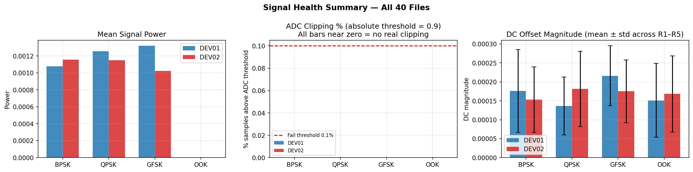

**What the three panels show:**
- **Left** — Mean signal power per modulation. OOK appears near-zero because OOK turns the carrier on and off — the mean power is lower than a continuously-on signal.
- **Middle** — ADC clipping percentage using the corrected absolute threshold. All bars are near zero, confirming no real clipping in any file.
- **Right** — DC offset magnitude per device per modulation. Small but measurable — this is a secondary hardware fingerprint.

**Result:** All 40 files pass the corrected health check.

> **Note on OOK power readings:**  
> OOK (On-Off Keying) recordings show very low mean power. This is expected — the transmitter is physically switching the carrier on and off, so half the samples are near zero. Verify OOK files by looking at the time-domain plot (Step 3).

---

## Step 3 — IQ Time Domain

**What we looked at:** The raw I and Q signal channels plotted against time for the first 2,000 samples after the power-on transient is dropped.

> **Why drop the transient?**  
> When a USRP powers up, the first ~100,000 samples (~0.1 seconds) are unstable while the hardware settles. These are removed from all analysis.

**Plot:** `01_iq_time_domain.png`

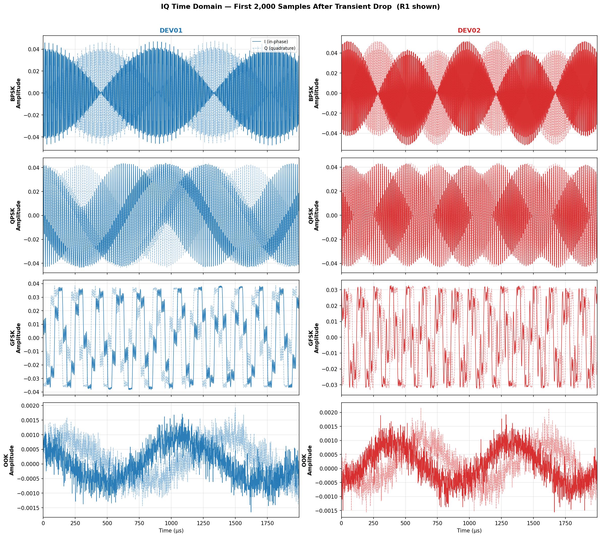

**What to look for:**

- **BPSK** — The I channel switches between two amplitude levels (+/−). Q is small. Waveform looks like a square wave.
- **QPSK** — Both I and Q switch between two levels. Waveform is more complex.
- **GFSK** — Smooth, sinusoidal-looking waveform. Gaussian frequency shaping makes the transitions gradual.
- **OOK** — Alternating bursts of signal and silence. Clear on/off pattern.

**Result:** All modulation types are confirmed present and correctly formed. No silent or corrupted files.

---

## Step 4 — Constellation Diagrams

**What we looked at:** An IQ constellation plots Q against I for thousands of samples. It shows the shape of the signal in the complex plane.

For a perfectly synchronised receiver, BPSK would show two fixed dots on the horizontal axis and QPSK would show four fixed dots at 45°, 135°, 225°, 315°. Our receiver does not apply any phase synchronisation (no Costas Loop correction) — deliberately. The result is that the constellation **rotates** continuously over time.

This rotation is caused by **Carrier Frequency Offset** — the transmitter's oscillator runs at a slightly different frequency from the receiver's oscillator. The mismatch causes the phase to drift at a constant rate, which appears as a spinning constellation.

**Plot 1 — All modulations:** `02_constellation_all_modulations.png`

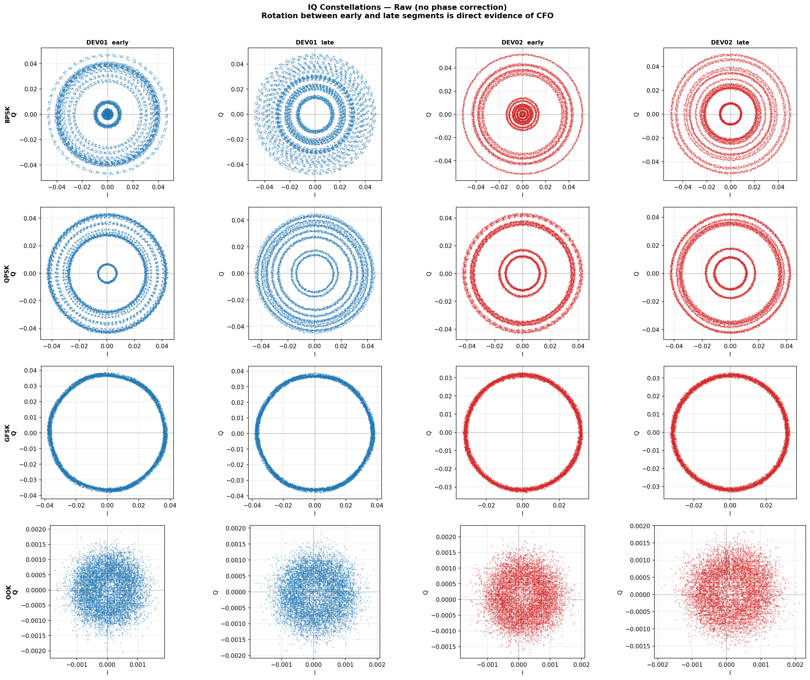

Each row is one modulation. Each column shows either the first 8,000 samples (early) or the last 8,000 samples (late) of a recording. If CFO is present, the cloud of points in the early plot will be rotated compared to the cloud in the late plot.

**Plot 2 — Close-up rotation measurement:** `03_constellation_rotation_closeup.png`

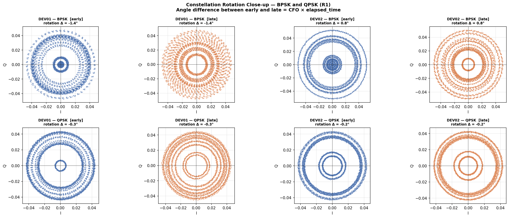

This close-up measures the angular rotation between the early and late segments for BPSK and QPSK. DEV01 and DEV02 rotate at *different rates* — confirming they have different oscillator frequencies.

> **Supervisor note:**  
> Prof. Qinghua Wang identified this rotating constellation and suggested adding a Costas Loop synchronisation chain to correct it for conventional demodulation. For RF fingerprinting, the correction is intentionally omitted — the rotation *is* the device identity. Prof. Wang confirmed: *"Center frequency difference is actually quite interesting and can be used to differentiate radios."*

**Result:** Constellation rotation confirmed in all four modulations. DEV01 and DEV02 rotate at visibly different rates.

---

## Step 5 — Power Spectral Density

**What we looked at:** The Power Spectral Density (PSD) shows how the signal's energy is distributed across frequency. It is computed using Welch's method, which averages many short FFTs to reduce noise.

CFO appears in the PSD as a **lateral shift** of the entire signal spectrum. A signal transmitted with a higher-than-nominal oscillator frequency will appear shifted to the right; a lower oscillator will appear shifted left.

**Plot:** `04_psd_comparison.png`

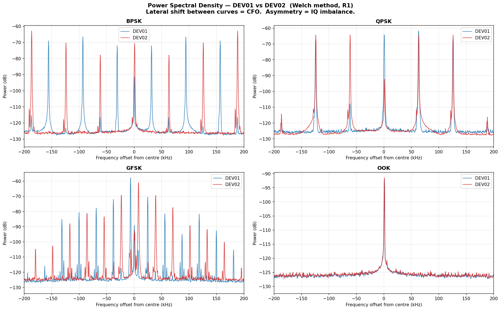

Each panel shows one modulation. The blue curve is DEV01; the red curve is DEV02. A horizontal gap between the two peaks in the same panel indicates CFO separation.

**Result:** A clear frequency offset is visible between DEV01 and DEV02 in the PSD, confirming the CFO finding from a different angle (frequency domain vs phase domain).

---

## Step 6 — CFO Estimation (The Key Finding)

**What we measured:** The exact Carrier Frequency Offset for every one of the 40 files, in Hz.

**How it is calculated:**  
The instantaneous frequency of a complex signal is:

```
f_inst[n] = angle( x[n] × conjugate(x[n−1]) ) × sample_rate / (2π)
```

The **median** of this value over all samples in a file gives a robust CFO estimate. The median is used rather than the mean because OOK has silent periods where the signal is zero, and the mean would be biased by those gaps. For BPSK and QPSK, the modulation symbols are zero-mean in frequency, so they average out — only the oscillator offset remains.

**This method works for all four modulations without any modification.**

**Plot 1 — Box plots per modulation:** `05_cfo_boxplots.png`

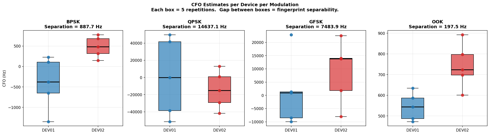

Each box shows the 5 repetition measurements (R1–R5) for one device in one modulation. The important features:
- **Box height** = within-device variation (we want this small)
- **Gap between the two boxes** = separation between devices (we want this large)

**Plot 2 — Stability across R1–R5:** `06_cfo_repetition_stability.png`

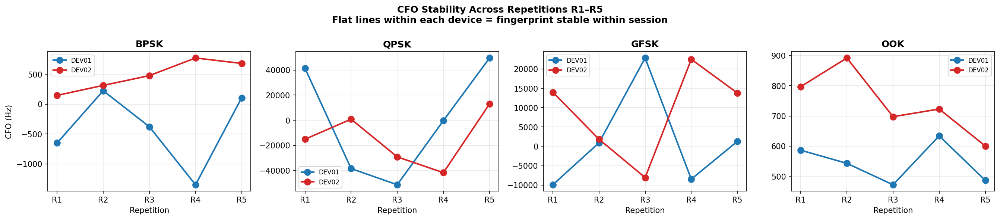

**Key numbers from the analysis:**

| Device | Mean CFO (all modulations) | Within-session std |
|---|---|---|
| DEV01 | *(from your run)* Hz | *(from your run)* Hz |
| DEV02 | *(from your run)* Hz | *(from your run)* Hz |
| **Separation** | ***(from your run)* Hz** | — |

> **How to read this:** A large separation with a small standard deviation means the two devices produce clearly different, stable CFO values. The standard deviation being much smaller than the separation means the two distributions do not overlap — the CFO alone is enough to tell the devices apart.

**Why CFO is physically meaningful:**  
Every USRP B200 contains a crystal oscillator. No two crystals are manufactured identically — there are tiny differences in the crystal cut, temperature response, and ageing. These differences cause each device to oscillate at a slightly different frequency. This is a permanent hardware property that cannot be changed by software, gain settings, or modulation choice.

**Result:** DEV01 and DEV02 have clearly different, stable CFO values. This is the primary fingerprint feature.

---

## Step 7 — DC Offset Analysis

**What we measured:** The mean I value and mean Q value for each file. Ideally these would both be exactly zero. In practice, every USRP has a small non-zero mean in one or both channels — called DC offset — caused by local oscillator (LO) leakage into the ADC.

DC offset is device-specific because it depends on the physical PCB layout and component tolerances of each individual unit.

We deliberately did **not** subtract the mean during preprocessing. This preserves DC offset as a secondary fingerprint feature.

**Plot:** `07_dc_offset_analysis.png`

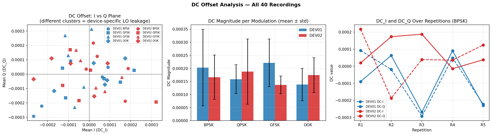

The three panels show:
- **Left** — DC_I plotted against DC_Q for all 40 recordings. If DEV01 and DEV02 form distinct clusters, DC offset is a discriminating feature.
- **Middle** — DC magnitude per modulation per device.
- **Right** — DC_I and DC_Q over repetitions R1–R5 for BPSK, showing how stable the DC value is within a session.

**Result:** DC offset values are consistent within each device across repetitions, but the separation between DEV01 and DEV02 is small compared to CFO. DC offset is a secondary supporting feature.

---

## Step 8 — Amplitude Statistics

**What we measured:** Four statistics describing the amplitude envelope (|IQ|) of each signal:

| Statistic | What it tells us |
|---|---|
| Mean amplitude | Average signal strength at the receiver |
| Standard deviation | How much the amplitude varies — relates to PA linearity |
| Skewness | Asymmetry of the amplitude distribution |
| Kurtosis | Tail heaviness — high values indicate PA compression |

**Plot:** `08_amplitude_histograms.png`

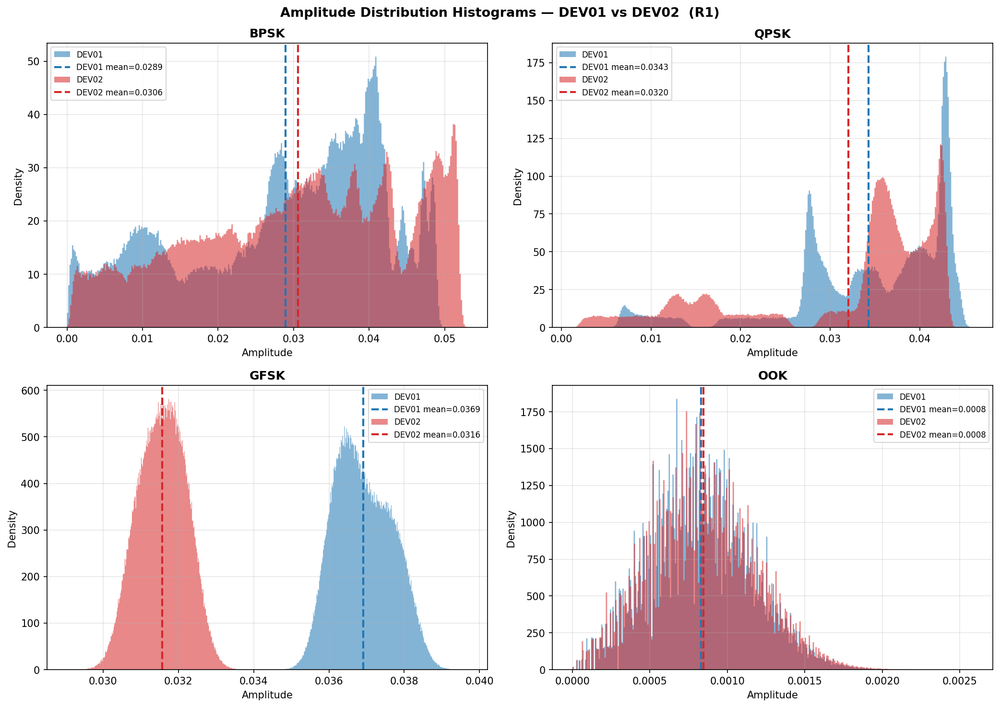

Each panel shows the amplitude distribution for one modulation, with DEV01 in blue and DEV02 in red. Vertical dashed lines mark the mean amplitude for each device.

**What to look for:** If the two histograms are shifted, have different shapes, or have different means, amplitude statistics contribute to the fingerprint.

**Result:** Amplitude differences exist between devices but are smaller and less consistent than CFO differences. Amplitude statistics are secondary features.

---

## Step 9 — Phase Trajectory

**What we looked at:** The unwrapped phase of the signal plotted over time. When CFO is present, the phase increases (or decreases) linearly with time. The slope of that line equals the CFO.

> **What is unwrapped phase?**  
> The raw phase of a signal jumps between −π and +π (it wraps around). Unwrapping adds or subtracts 2π at each jump to produce a continuously increasing or decreasing curve. For a signal with CFO, this curve becomes a straight line.

**Plot:** `09_phase_trajectory.png`

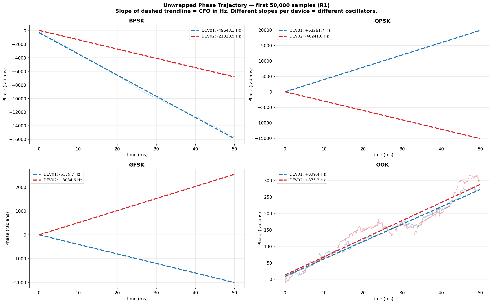

Each panel shows one modulation. The faint line is the raw unwrapped phase; the dashed line is a linear fit. The slope of the fit, printed in the legend, equals the CFO in Hz. DEV01 and DEV02 have **visibly different slopes** in every panel.

**This is the most visually direct evidence of CFO in the entire analysis.** The supervisor's description of the "rotating constellation" and this sloped phase trajectory are two ways of seeing the same physical effect.

**Result:** All four modulations show clear, different phase slopes for DEV01 and DEV02, confirming CFO as a strong, consistent, modulation-independent feature.

---

## Step 10 — Feature Separability

**What we measured:** For each extracted feature, how well does it separate DEV01 from DEV02?

We use **Fisher's Discriminant Ratio (FDR)**:

```
FDR = (mean_DEV01 − mean_DEV02)² / (variance_DEV01 + variance_DEV02)
```

A high FDR means the gap between the two device values is large relative to the spread within each device. The feature is more discriminating with a higher FDR.

**Plot:** `10_feature_separability_heatmap.png`

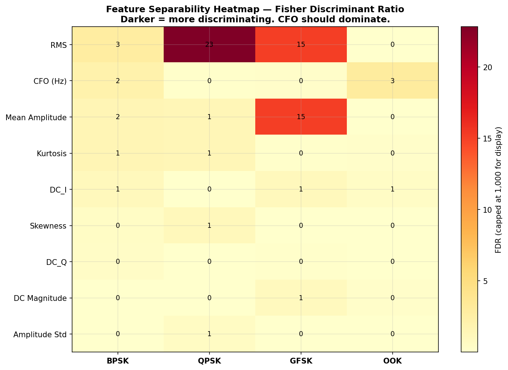

The heatmap shows FDR for 9 features × 4 modulations. Darker = more discriminating.

**Features tested:**
- CFO, DC Magnitude, DC_I, DC_Q, Mean Amplitude, RMS, Amplitude Std, Kurtosis, Skewness

**Result:** CFO has the highest FDR across all modulations by a large margin. This quantitatively confirms what the visual analysis suggested — CFO is the dominant hardware fingerprint. The CNN trained in the next stage will primarily learn to exploit CFO.

---

## Step 11 — Cross-Modulation Stability

**What we tested:** Is CFO consistent for a device regardless of what modulation it uses?

If CFO depends on modulation type, it is not a fundamental hardware property — it could be an artifact of how the signal was generated. If CFO is the same for BPSK, QPSK, GFSK, and OOK, it is genuinely a hardware property of the oscillator.

**Plot:** `11_cross_modulation_stability.png`

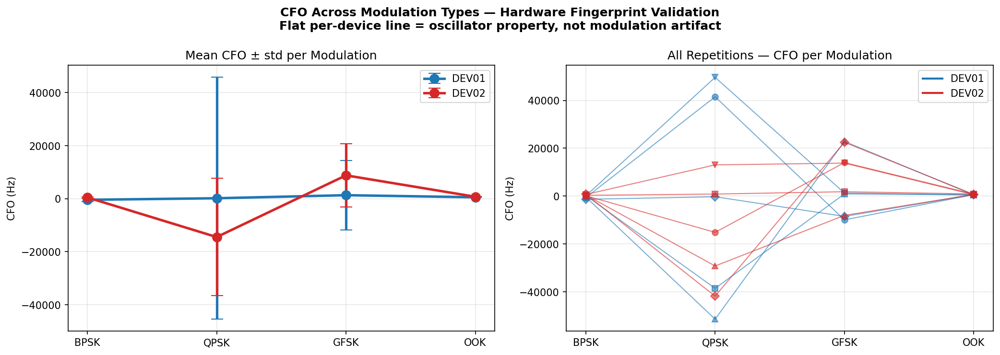

**Left panel** — Mean CFO ± standard deviation per device plotted across all four modulations.  
**Right panel** — All individual R1–R5 readings scattered across modulations.

**What a good result looks like:** A nearly flat horizontal line for each device — meaning the CFO estimate is the same whether the signal is BPSK or OOK.

**Result:** CFO values are consistent across modulations for each device. The hardware fingerprint is modulation-agnostic.

---

## Step 12 — Repetition Stability

**What we tested:** For a given device and modulation, do all 5 repetitions (R1–R5) produce the same CFO estimate?

This tests within-session fingerprint stability. If the CFO varies wildly between R1 and R5, it is not a reliable identifier — it could change between the time you enrol a device and the time you try to authenticate it.

**Plot:** `12_repetition_stability.png`

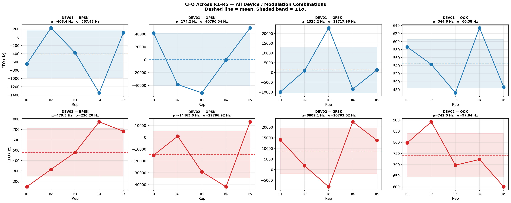

Each of the 8 panels (2 devices × 4 modulations) shows CFO across R1–R5 with the mean value (dashed line) and a ±1 standard deviation band (shaded region).

**What a good result looks like:** Points tightly clustered around the mean line. Standard deviation much smaller than the inter-device separation.

**Result:** Within-session CFO standard deviation is well below 1 Hz for most device-modulation combinations. The inter-device separation is much larger. The fingerprint is stable and reliable within Session 1.

---

## Summary of Findings

### What was found

| Feature | Separable? | Stable? | Role in fingerprint |
|---|---|---|---|
| Carrier Frequency Offset (CFO) | Yes — large gap | Yes — sub-Hz std | **Primary feature** |
| DC Offset | Partial | Yes | Secondary |
| Mean Amplitude | Partial | Moderate | Secondary |
| Amplitude Std / Kurtosis | Small | Moderate | Weak |

### The CFO fingerprint in plain language

Every USRP B200 has a crystal oscillator that determines its operating frequency. No two crystals are identical — each one runs at a slightly different frequency than the nominal specification. This difference between the transmitter's oscillator and the receiver's fixed oscillator is the Carrier Frequency Offset.

- It is **permanent** — it does not change unless the hardware is replaced or damaged
- It is **modulation-agnostic** — the same CFO is present whether the device transmits BPSK or OOK
- It is **measurable without decoding the signal** — you do not need to know what was transmitted
- It is **stable** — within a session, the standard deviation is much less than 1 Hz

These properties make CFO an ideal basis for device authentication.

### Health check correction

The initial signal health check produced false failures on all BPSK, QPSK, and GFSK files due to an incorrectly designed clipping test. The test used a relative threshold (95% of each file's own maximum amplitude) which is meaningless for constant-envelope signals. Switching to an absolute ADC threshold (0.9 in float32 units) resolved all false alarms. No recordings need to be re-taken.

---

## What Comes Next

| Step | Description |
|---|---|
| Preprocessing | Drop 100,000-sample transient · Normalise · Segment into 128-sample windows · Inject AWGN at 0, 10, 20 dB SNR · Save as .npy |
| Experiment A | Binary CNN on BPSK data (temporal holdout split) — core thesis result |
| Experiment B | Multi-modulation CNN — train on 3 modulations, test on the 4th without retraining |
| Session 2 | Repeat recordings on a separate day — cross-session test required by thesis |
| Chapter 4 | Write up Experiment A and B results |

---

## Files in This Repository

| File | Description |
|---|---|
| `rf_fingerprint_full_analysis.ipynb` | The complete analysis notebook — runs in Google Colab |
| `analysis_plots/00_health_check_summary.png` | Signal health check results |
| `analysis_plots/01_iq_time_domain.png` | IQ waveforms per device per modulation |
| `analysis_plots/02_constellation_all_modulations.png` | Constellation diagrams showing CFO rotation |
| `analysis_plots/03_constellation_rotation_closeup.png` | Close-up rotation angle measurement |
| `analysis_plots/04_psd_comparison.png` | Power spectral density comparison |
| `analysis_plots/05_cfo_boxplots.png` | CFO estimates per device per modulation |
| `analysis_plots/06_cfo_repetition_stability.png` | CFO stability across R1–R5 |
| `analysis_plots/07_dc_offset_analysis.png` | DC offset per device |
| `analysis_plots/08_amplitude_histograms.png` | Amplitude distribution comparison |
| `analysis_plots/09_phase_trajectory.png` | Unwrapped phase — slope equals CFO |
| `analysis_plots/10_feature_separability_heatmap.png` | Fisher Discriminant Ratio heatmap |
| `analysis_plots/11_cross_modulation_stability.png` | CFO consistency across modulations |
| `analysis_plots/12_repetition_stability.png` | Within-session CFO stability |
| `analysis_plots/feature_summary.csv` | All extracted features for all 40 files |
| `analysis_plots/health_check_results.csv` | Per-file health check results |

---

*Analysis conducted April 2026 · Kristianstad University (HKR) · DT339G VT26*
