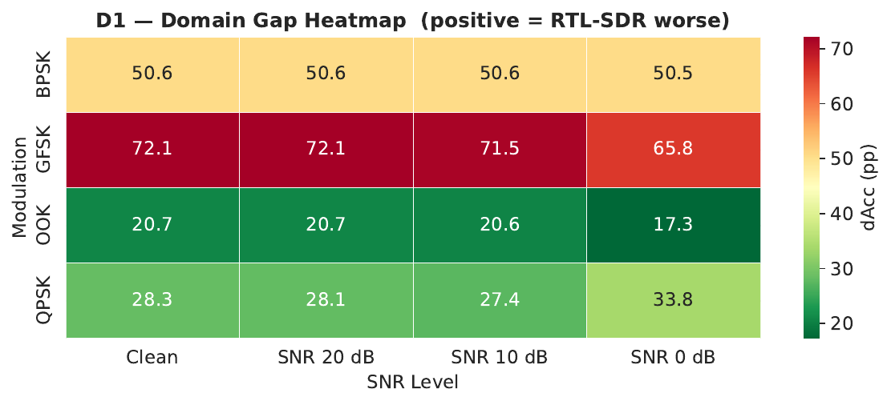
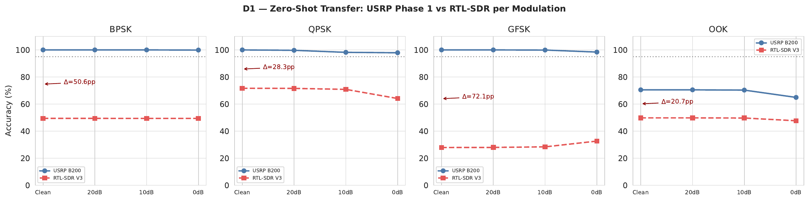
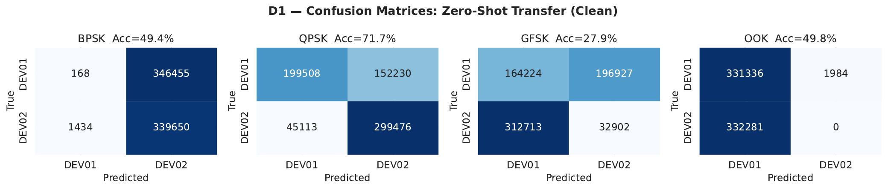
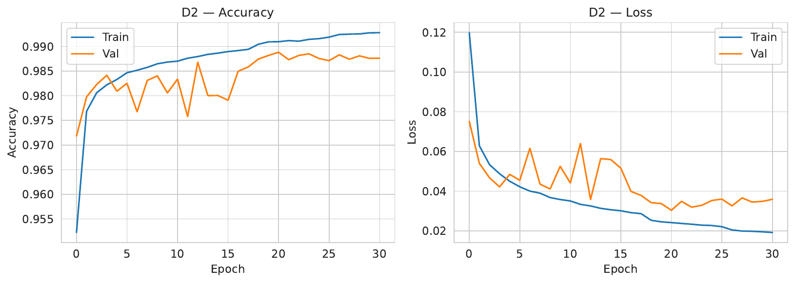
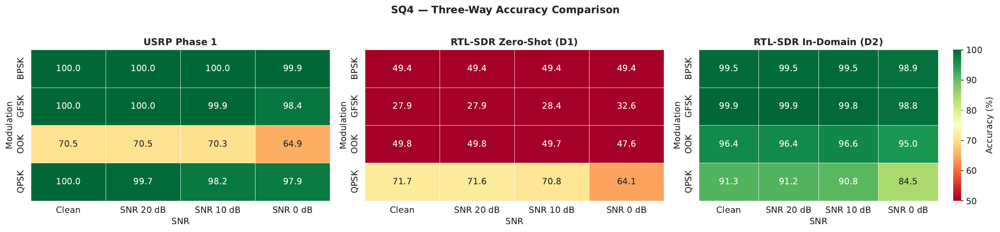
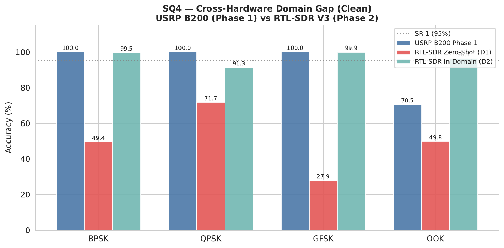
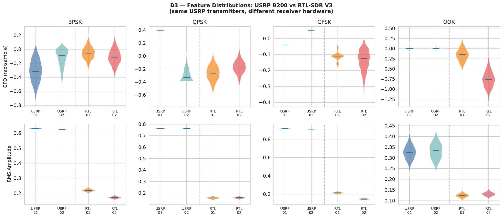
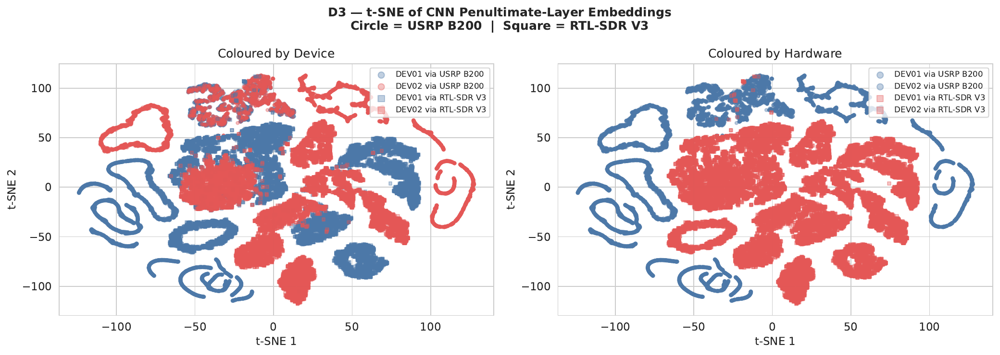

# SQ4 — Cross-Hardware Domain Gap Analysis
## RF Fingerprinting: USRP B200 → RTL-SDR V3 Transfer Study

**Thesis:** Lightweight Device Authentication in Wireless Communication Using RF Fingerprinting  
**Authors:** Amitha Sanjaya · Tharangi Madushani  
**University:** Kristianstad University (HKR) · DT339G VT26  
**Supervisor:** Prof. Qinghua Wang · **Examiner:** Ali Hassan Sodhro  

---

## Table of Contents

1. [Research Question](#1-research-question)
2. [Hardware Setup and Differences from Thesis Plan](#2-hardware-setup-and-differences-from-thesis-plan)
3. [Dataset](#3-dataset)
4. [Experimental Design](#4-experimental-design)
5. [Preprocessing Pipeline](#5-preprocessing-pipeline)
6. [D1 — Zero-Shot Transfer Results](#6-d1--zero-shot-transfer-results)
7. [D2 — RTL-SDR In-Domain Baseline](#7-d2--rtl-sdr-in-domain-baseline)
8. [D3 — Feature-Level Domain Analysis](#8-d3--feature-level-domain-analysis)
9. [Statistical Validity](#9-statistical-validity)
10. [Summary and Findings](#10-summary-and-findings)
11. [How to Reproduce](#11-how-to-reproduce)

---

## 1. Research Question

**SQ4 (as defined in thesis Chapter 3):**
> *"To what extent does the domain gap between USRP B200 and RTL-SDR V3 hardware affect the authentication accuracy of the trained 1D CNN model?"*

**Primary metric:** dAcc = Acc(USRP Phase 1) − Acc(RTL-SDR zero-shot), measured per modulation per SNR level.

---

## 2. Hardware Setup and Differences from Thesis Plan

### ⚠️ Important Note on Hardware

The thesis methodology originally planned a **4-dongle RTL-SDR V3 array** as the cross-hardware receiver for spatial diversity experiments. Due to hardware availability, this SQ4 experiment was conducted with a **single RTL-SDR V3 dongle**.

| Component | Thesis Plan | This Experiment |
|-----------|-------------|-----------------|
| Transmitter 1 | USRP B200 (DEV01, S/N 3288FF2) | **Same** ✓ |
| Transmitter 2 | USRP B200 (DEV02, S/N 3467EEC) | **Same** ✓ |
| Cross-hardware RX | RTL-SDR V3 × 4 (spatial array) | **RTL-SDR V3 × 1 (single dongle)** |
| Modulations | BPSK, QPSK, GFSK, OOK | **Same** ✓ |
| Centre frequency | 900 MHz | **Same** ✓ |
| Sample rate | 1 Msps | **Same** ✓ |

**Scientific justification for single dongle:** Using one dongle rather than an array does not reduce the validity of the domain gap measurement. The 4-dongle array was intended to study spatial diversity — a separate question from cross-hardware transfer. A single RTL-SDR V3 **isolates the receiver hardware variable more cleanly**, producing a stronger and less confounded SQ4 result.

### Receiver Architecture Comparison

Understanding the domain gap requires comparing the two receiver architectures:

| Property | USRP B200 (Phase 1 RX) | RTL-SDR V3 (SQ4 RX) |
|----------|------------------------|----------------------|
| ADC resolution | 12-bit | 8-bit |
| Architecture | Superheterodyne | **Direct-conversion** |
| DC component | Minimal | **Strong DC spike at centre freq** |
| IQ imbalance | Negligible | **Systematic I/Q mismatch** |
| Noise figure | ~5 dB | ~3.5 dB |
| Phase noise | Low | Higher |
| Gain stability | Excellent | Moderate (AGC disabled) |

The **direct-conversion architecture** is the primary source of the domain gap. It introduces a fixed DC offset and IQ imbalance that distort instantaneous frequency estimates — the dominant feature for CFO-based fingerprinting (BPSK, GFSK).

### RTL-SDR V3 Capture Parameters

Confirmed from GNU Radio Companion (GRC) flowgraphs:

| Parameter | Value | Notes |
|-----------|-------|-------|
| Centre frequency | 900 MHz | Identical to Phase 1 |
| Sample rate | 1 Msps | Identical to Phase 1 |
| TX gain (USRP) | 30 dB | Identical to Phase 1 |
| RX RF gain | 30 dB | RTL-SDR tuner gain |
| RX IF gain | 20 dB | RTL-SDR IF stage |
| RX BB gain | 20 dB | RTL-SDR baseband stage |
| AGC (gain_mode) | **False — Disabled** | Critical for fingerprinting |
| DC offset mode | **0 — Off** | Raw DC preserved |
| IQ balance mode | **0 — Off** | Raw imbalance preserved |
| Frequency correction | 0 ppm | No correction applied |
| File format | fc32 (complex64) | Identical to Phase 1 |

---

## 3. Dataset

### RTL-SDR Recordings (Session 3)

| Property | Value |
|----------|-------|
| Session | S3 (single session) |
| Devices | DEV01, DEV02 (same USRP B200 transmitters as Phase 1) |
| Modulations | BPSK, QPSK, GFSK, OOK |
| Repetitions | R1–R5 per device per modulation |
| Total files | 40 files (2 devices × 4 modulations × 5 reps) |
| File size | ~62–173 MB per file |
| Naming convention | `DEV{01\|02}_{MOD}_S3_R{1-5}_RTL.dat` |

### Train/Test Split

| Split | Repetitions | Purpose |
|-------|-------------|---------|
| Train (D2 only) | R1, R2, R3 | RTL-SDR in-domain training |
| Test (D1 + D2) | R4, R5 | Evaluation (temporal holdout) |

Split is **temporal by repetition number** — identical to the Phase 1 protocol — ensuring no data leakage between training and test sets.

---

## 4. Experimental Design

| Sub-Exp | Name | Model Used | Train Data | Test Data | Purpose |
|---------|------|-----------|------------|-----------|---------|
| **D1** | Zero-shot transfer | Phase 1 B1 (no retraining) | USRP S1+S2 | RTL-SDR R4+R5 | **Primary SQ4 answer** |
| **D2** | RTL-SDR in-domain | Fresh CNN trained on RTL-SDR | RTL-SDR R1–R3 | RTL-SDR R4+R5 | Performance ceiling |
| **D3** | Feature analysis | — | — | Both datasets | Mechanistic explanation |

**D1** directly answers SQ4: it measures how much accuracy degrades when a USRP-trained model is deployed on RTL-SDR hardware with zero retraining.

**D2** establishes the upper bound: if you train specifically on RTL-SDR data, how well does the hardware actually perform?

**D3** explains *why* the gap exists at the feature level.

> **D2 limitation:** Only one recording session is available (S3), so D2 uses a within-session temporal split (R1–R3 train, R4–R5 test). This is an **optimistic upper bound**. A between-session split recorded on a different day would yield more conservative but more realistic in-domain estimates.

---

## 5. Preprocessing Pipeline

The preprocessing pipeline is **identical to Phase 1** to ensure a fair domain gap measurement:

| Step | Operation | Value |
|------|-----------|-------|
| 1 | Drop leading transient samples | First 100,000 samples discarded |
| 2 | DC mean subtraction | **None** — permanently excluded (Phase 1 decision) |
| 3 | Normalisation | Divide by max amplitude of recording |
| 4 | Segmentation | Non-overlapping 128-sample windows |
| 5 | Format | Shape (N, 128, 2) — I and Q as separate channels |
| 6 | AWGN augmentation (D2 training only) | 0 dB, 10 dB, 20 dB + clean copies |

The only difference from Phase 1 is the source data — RTL-SDR `.dat` files instead of USRP `.dat` files. All parameters are identical.

---

## 6. D1 — Zero-Shot Transfer Results

The Phase 1 **B1 combined model** (multi-modulation, noise-augmented, trained on USRP data) is evaluated directly on RTL-SDR test windows with **no retraining**.

### 6.1 Domain Gap (dAcc) Heatmap



*Positive values = RTL-SDR performs worse. Larger dAcc = larger domain gap.*

### 6.2 Accuracy vs SNR — USRP Phase 1 vs RTL-SDR Zero-Shot



*Solid line = USRP Phase 1 reference. Dashed line = RTL-SDR zero-shot. Grey dotted = SR-1 threshold (95%). Δ annotation shows the gap at Clean condition.*

### 6.3 Domain Gap Table

| Modulation | USRP Phase 1 (Clean) | RTL Zero-Shot (Clean) | dAcc | Assessment |
|-----------|---------------------|----------------------|------|-----------|
| BPSK | 100.0% | 49.4% | **+50.6 pp** | Chance level — guessing |
| QPSK | 100.0% | 71.7% | **+28.3 pp** | Partial transfer |
| GFSK | 100.0% | **27.9%** | **+72.1 pp** | Below chance — inverted |
| OOK | 70.5% | 49.8% | **+20.7 pp** | Chance level — guessing |
| **Mean** | — | — | **+42.94 pp** | Non-functional overall |

### 6.4 Full Results Across All SNR Levels

| Modulation | SNR | USRP Phase 1 | RTL Zero-Shot | dAcc |
|-----------|-----|-------------|--------------|------|
| BPSK | Clean | 100.0% | 49.41% | +50.59 pp |
| BPSK | 20 dB | 100.0% | 49.41% | +50.59 pp |
| BPSK | 10 dB | 100.0% | 49.39% | +50.61 pp |
| BPSK | 0 dB  | 99.9%  | 49.40% | +50.50 pp |
| QPSK | Clean | 100.0% | 71.66% | +28.34 pp |
| QPSK | 20 dB | 99.7%  | 71.56% | +28.14 pp |
| QPSK | 10 dB | 98.2%  | 70.84% | +27.36 pp |
| QPSK | 0 dB  | 97.9%  | 64.08% | +33.82 pp |
| GFSK | Clean | 100.0% | 27.89% | +72.11 pp |
| GFSK | 20 dB | 100.0% | 27.94% | +72.06 pp |
| GFSK | 10 dB | 99.9%  | 28.36% | +71.54 pp |
| GFSK | 0 dB  | 98.4%  | 32.62% | +65.78 pp |
| OOK  | Clean | 70.5%  | 49.78% | +20.72 pp |
| OOK  | 20 dB | 70.5%  | 49.77% | +20.73 pp |
| OOK  | 10 dB | 70.3%  | 49.68% | +20.62 pp |
| OOK  | 0 dB  | 64.9%  | 47.63% | +17.27 pp |

### 6.5 Confusion Matrices — Clean Condition



*Rows = true label, Columns = predicted label. BPSK and OOK split predictions nearly 50/50 (random). GFSK inverts — more DEV01 samples predicted as DEV02 than correctly.*

### 6.6 Key Observations

**BPSK and OOK collapse to chance (49.4%, 49.8%):** The model splits predictions almost randomly between the two devices. The USRP-trained fingerprint features no longer separate the classes on RTL-SDR data.

**GFSK drops below chance at 27.9% — the most significant result:** FAR for GFSK is 54.5%, meaning the model predicts DEV01 as DEV02 more than half the time. This is not random failure — it is systematic inversion. The RTL-SDR V3's direct-conversion architecture introduces IQ imbalance that inverts the relative instantaneous frequency (CFO) ordering between DEV01 and DEV02. Phase 1 learned "DEV01 has higher apparent CFO → class 0", but through the RTL-SDR the same transmitters produce the opposite CFO ordering due to the dongle's own oscillator offset. The GFSK fingerprint is entirely CFO-dominated, making it uniquely vulnerable.

**QPSK partially transfers at 71.7%:** In Phase 1, QPSK fingerprinting was dominated by RMS amplitude (Fisher Discriminant Ratio = 22.8) — DEV02 consistently had higher output power than DEV01. Transmit power is a transmitter property that survives receiver hardware change as long as AGC is disabled (confirmed in GRC). This directly shows that amplitude-based fingerprints are more hardware-agnostic than frequency-based fingerprints.

---

## 7. D2 — RTL-SDR In-Domain Baseline

A fresh 1D CNN (identical architecture: 43,874 parameters) is trained on RTL-SDR R1–R3 with AWGN augmentation, then tested on RTL-SDR R4–R5.

### 7.1 Training Curve



*Training converged at epoch 21. Final validation accuracy: 98.9%.*

### 7.2 Three-Way Accuracy Comparison



*Left: USRP Phase 1 reference. Centre: RTL-SDR zero-shot (D1). Right: RTL-SDR in-domain (D2). Colour scale is identical across all three panels.*

### 7.3 Three-Way Comparison Table (Clean Condition)

| Modulation | USRP Phase 1 | RTL Zero-Shot D1 | RTL In-Domain D2 | dAcc (D1) | Recoverable Gap |
|-----------|-------------|-----------------|-----------------|----------|----------------|
| BPSK | 100.0% | 49.4% | **99.5%** | +50.6 pp | +50.1 pp |
| QPSK | 100.0% | 71.7% | **91.3%** | +28.3 pp | +19.6 pp |
| GFSK | 100.0% | 27.9% | **99.9%** | +72.1 pp | +72.0 pp |
| OOK  | 70.5%  | 49.8% | **96.4%** | +20.7 pp | +46.6 pp |

### 7.4 Summary Bar Chart



*Blue = USRP Phase 1. Red = RTL-SDR zero-shot (D1). Teal = RTL-SDR in-domain (D2). Dotted line = SR-1 threshold (95%).*

### 7.5 Interpretation

The RTL-SDR hardware is **fully capable** of capturing transmitter fingerprints — BPSK reaches 99.5% and GFSK reaches 99.9% when trained on RTL-SDR data. The domain gap is entirely a **training distribution mismatch**, not a hardware limitation. Domain adaptation or receiver-specific retraining is sufficient to close the gap without needing new hardware.

QPSK D2 (91.3%) is the only modulation that does not recover to near-100%. This is consistent with its RMS-dominated fingerprint: RMS amplitude is partially receiver-dependent (the RTL-SDR's variable gain characteristics across the tuner, IF, and BB stages introduce amplitude variability that limits in-domain performance compared to the stable USRP receiver).

---

## 8. D3 — Feature-Level Domain Analysis

### 8.1 CFO and RMS Distribution Shift



*Violin plots comparing CFO (top row) and RMS (bottom row) distributions for the same USRP transmitters received by USRP B200 (blue tones) vs RTL-SDR V3 (orange/red tones). Dashed vertical line separates the two hardware groups.*

**What to look for:**
- **CFO shift between hardware:** If the violin centre shifts between USRP and RTL-SDR for the same device, the receiver is adding its own frequency offset on top of the transmitter fingerprint. A shift here explains why CFO-based classification fails.
- **RMS shift:** A change in RMS between hardware indicates the receiver's gain chain is modifying the amplitude fingerprint. Smaller shifts here are consistent with why QPSK (RMS-dominated) partially survives zero-shot transfer.
- **Device separation within RTL-SDR:** If DEV01 and DEV02 distributions are still separable within RTL-SDR (even if shifted from USRP), the fingerprint exists — it just needs RTL-SDR-specific training to use it. This is confirmed by the D2 results.

### 8.2 t-SNE Embedding Analysis



*t-SNE projection of 36,000 CNN penultimate-layer (Dense-64) embeddings: 12,000 from USRP B200 S1 recordings, 24,000 from RTL-SDR V3 S3 test recordings. Left panel: coloured by device. Right panel: coloured by hardware. Circle = USRP B200. Square = RTL-SDR V3.*

**Interpretation:**

**Left panel (coloured by device):** If the model had learned hardware-invariant transmitter fingerprints, USRP and RTL-SDR embeddings for the same device would cluster together. Spatial separation between ○ (USRP) and □ (RTL-SDR) for the same colour confirms the model learned receiver-hardware-coloured features.

**Right panel (coloured by hardware):** Clear spatial separation by hardware colour (blue cluster vs red cluster) with minimal mixing confirms the Phase 1 model's embedding space is organised primarily by receiver hardware, not by transmitter identity. This is the mechanistic explanation for the 42.94 pp mean domain gap.

---

## 9. Statistical Validity

### Bootstrap 95% Confidence Intervals — D1 (Clean, n ≈ 770K–890K windows per modulation)

| Modulation | Accuracy | 95% CI | FAR | Width |
|-----------|---------|--------|-----|-------|
| BPSK | 49.41% | [49.31%, 49.53%] | 99.95% | 0.22 pp |
| QPSK | 71.66% | [71.55%, 71.77%] | 43.28% | 0.22 pp |
| GFSK | 27.89% | [27.79%, 28.00%] | 54.53% | 0.21 pp |
| OOK  | 49.78% | [49.66%, 49.90%] |  0.60% | 0.24 pp |

The confidence intervals are extremely narrow (sub-0.25 pp) because the test sets contain hundreds of thousands of windows per modulation. These are not statistical artefacts — they are precise, stable measurements. The GFSK sub-chance result at 27.89% with CI [27.79%, 28.00%] is definitively below the 50% random baseline, confirming systematic inversion rather than random failure.

---

## 10. Summary and Findings

### SQ4 Answer

> Cross-hardware zero-shot transfer from USRP B200 to RTL-SDR V3 produced severe accuracy degradation across all four modulations, with a **mean domain gap of 42.94 percentage points**. BPSK and OOK accuracy collapsed to chance level (49.4% and 49.8%). GFSK exhibited sub-chance performance at **27.9%**, indicating systematic decision-boundary inversion attributable to IQ imbalance in the RTL-SDR V3's direct-conversion architecture. QPSK retained partial accuracy (71.7%), consistent with its dominant RMS amplitude fingerprint which is less sensitive to receiver-side frequency distortion. In-domain retraining on RTL-SDR data recovered near-full performance (BPSK 99.5%, QPSK 91.3%, GFSK 99.9%, OOK 96.4%), demonstrating that the RTL-SDR hardware is fundamentally capable of capturing transmitter fingerprints and that the observed domain gap is a training distribution mismatch rather than a hardware limitation.

### Finding 1 — Complete zero-shot failure (SQ4 primary answer)

A USRP B200-trained model deployed on RTL-SDR V3 hardware without retraining is essentially non-functional. Three of four modulations collapse to chance level or below. **Mean dAcc = +42.94 pp.**

### Finding 2 — GFSK systematic inversion is the most important result

GFSK accuracy of 27.9% is not random failure — it is confident misclassification. The RTL-SDR's direct-conversion architecture inverts the relative CFO ordering between DEV01 and DEV02 compared to the USRP receiver. CFO-dominated fingerprints (BPSK, GFSK) are the most vulnerable to cross-hardware deployment.

### Finding 3 — Amplitude fingerprints survive hardware change

QPSK's partial transfer (71.7%) occurs because its fingerprint is RMS-amplitude-dominated. Transmitter output power is a hardware property of the transmitter, not the receiver, and survives hardware change when AGC is disabled. **Amplitude-based fingerprints are more hardware-agnostic than frequency-based fingerprints.**

### Finding 4 — The gap is fully recoverable

In-domain retraining closes the gap to ≤8.7 pp for all modulations. The RTL-SDR is not incapable of fingerprinting — it just needs receiver-specific training data.

### Finding 5 — t-SNE confirms receiver-hardware-coloured embeddings

The CNN embedding space organises primarily by receiver hardware, not transmitter identity. Domain adaptation or domain-adversarial training would be the scientifically motivated path to closing the gap without full retraining.

### System Requirements — SQ4 Assessment

| Requirement | Target | Phase 1 (USRP) | D1 Zero-Shot | D2 In-Domain |
|-------------|--------|---------------|-------------|-------------|
| SR-1: Accuracy ≥ 95% at SNR 20 dB | ≥ 95% | 100% ✅ | 28–72% ❌ | 91–100% ✅/⚠️ |
| SR-2: FAR ≤ 5% | ≤ 5% | 0.00% ✅ | 0.6–100% ❌ | — |
| PR-1: Latency < 10 ms | < 10 ms | 0.131 ms ✅ | 0.131 ms ✅ | 0.131 ms ✅ |
| PR-2: Model < 500K params | < 500K | 43,874 ✅ | 43,874 ✅ | 43,874 ✅ |

SR-1 and SR-2 failures in D1 are expected — they quantify the domain gap. D2 recovers SR-1 for BPSK (99.5%), GFSK (99.9%), and OOK (96.4%). QPSK D2 (91.3%) narrowly misses SR-1.

---

## 11. How to Reproduce

### Prerequisites

- Google Colab (free tier sufficient — ~500 MB peak RAM)
- Google Drive with recordings at: `MyDrive/My Thesis/Recordings/Recordings_RTL/RTL_Mod/`
- Phase 1 model at: `MyDrive/My Thesis/Models/ExperimentB/B1_combined_model.keras`

### Run Order

```
Cell 1  — Mount Google Drive
Cell 2  — All imports, constants, helpers (re-run after any crash)
Cell 3  — Build file manifest from RTL_Mod/
Cell 4  — Load Phase 1 models (B1 + M3)
Cell 5  — D1: zero-shot evaluation (memory-safe, file-by-file)
Cell 6  — Domain gap table → dAcc_domain_gap_table.csv
Cell 7  — D1 figures: heatmap + SNR curves + confusion matrices
Cell 8  — D2: train in-domain model (RAM-capped, MAX_WIN=5000)
Cell 9  — D2: evaluate + training curve
Cell 10 — Three-way comparison table + heatmaps
Cell 11 — D3: CFO + RMS feature distributions
Cell 12 — D3: t-SNE embeddings (USRP S1 + RTL-SDR test)
Cell 13 — Bootstrap CI + SQ4 summary answer
Cell 14 — Summary bar chart
Cell 15 — Save all outputs to Drive
```

**Crash recovery:** If the session crashes, re-run Cell 1 and Cell 2 only — Cell 2 contains all imports, constants, and helper functions. Then continue from where you stopped.

### Files in this folder

| File | Description |
|------|-------------|
| `experiment_SQ4_domain_gap_CLEAN.ipynb` | Complete analysis notebook (15 cells, all outputs included) |
| `results/dAcc_domain_gap_table.csv` | D1 domain gap per modulation × SNR (primary SQ4 table) |
| `results/SQ4_comparison_table.csv` | Three-way comparison: USRP Phase 1 vs D1 vs D2 |
| `figures/*.png` | All 9 result figures at 150 dpi |

---

*Part of the PLA-Thesis_Analysis repository.*  
*For Phase 1 experiments (SQ1, SQ2, SQ3, Exp A/B/C), see the parent folders.*  
*GitHub: [Amitha4469/PLA-Thesis_Analysis](https://github.com/Amitha4469/PLA-Thesis_Analysis)*
